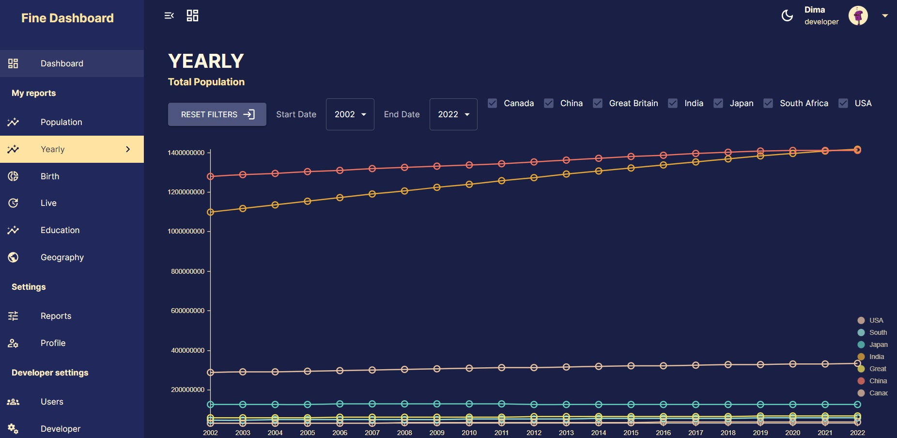
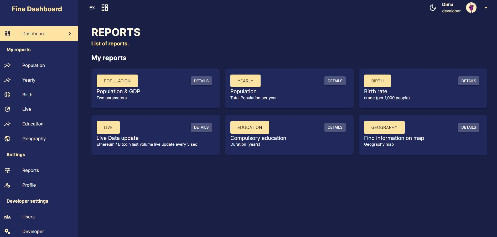
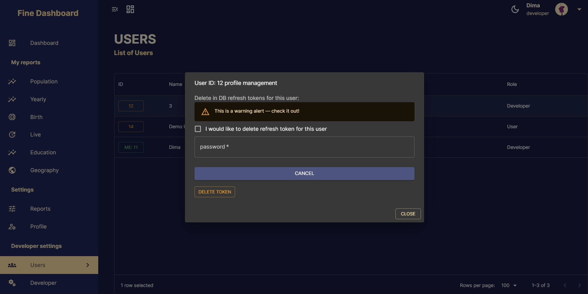

# Fine Dashboard


The application presents a diverse range of graphs derived from the data stored within the database. A robust authentication system is integrated to guarantee secure user entry to both data and functionalities. The Full Stack Fine Dashboard App exhibits data through dynamic charts and provides comprehensive user profile administration. The app's technology stack comprises:

- Frontend: React and Material UI
- Backend: Node.js
- Database: ElephantSQL
- Authentication System: JWT-based

Live demo: https://fine-dashboard.onrender.com/

## Table of Contents

- [Fine Dashboard](#fine-dashboard)
  - [Table of Contents](#table-of-contents)
  - [Description](#description)
  - [Data Identification](#data-identification)
    - [Data Collection \& Pre-processing:](#data-collection--pre-processing)
  - [Database](#database)
  - [Backend and API](#backend-and-api)
  - [Frontend](#frontend)
  - [Authentication](#authentication)
    - [User Roles and Permissions:](#user-roles-and-permissions)
  - [Future Scalability](#future-scalability)
  - [Installation](#installation)

## Description

App offers a streamlined approach to business intelligence, focusing on essential functionalities without the burden of costly licenses. While established BI systems like Tableau, Power BI or Fine BI provide extensive data analytics capabilities, they often come at a significant financial expense.

Many users find that their daily work only requires a handful of reports, typically around 5 to 10 views, along with standard filters and the ability to analyze data in detail using CSV downloads. Fine Dashboard caters to this specific need.

By prioritizing simplicity and efficiency, App empowers users with curated views and straightforward features, ensuring they can access the insights they need without unnecessary complexity.

## Data Identification

World Bank  API has been selected for data collection : https://datahelpdesk.worldbank.org/knowledgebase/articles/889392-api-documentation
The World Bank data consists of demographic and other statistical data related to Population, Employment, GDP, Energy Consumption, etc. for different the countries from the year 1960 to 2022. These categories are called indicators and are each defined by a code.
Example of  indicators:
* SP.POP.TOTL - Total Population
* SP.DYN.CBRT.IN Birth Rate
* SE.COM.DURS - Compulsory Education Duration
* NY.GDP.MKTP.CD - GDP in USD

The following countries have been chosen for data collection:
* US - United States of America
* IN - India
* CN - China
* JP - Japan
* CA - Canada
* GB - Great Britain
* ZA - South Africa

The base API URL is http://api.worldbank.org/v2/ and is followed by the country code and indicator code to obtain the data for each year. No authentication is required to use the API.

### Data Collection & Pre-processing: 
The aforementioned data is meticulously gathered through a loop of async API calls, subsequently subjected to preprocessing and parsing procedures, and stored within a dedicated table. This meticulous process ensures the organization and accessibility of the collected information for efficient utilization.


For live update data used Binance free API:  https://data.binance.com/api/v3/ticker/24hr
A limitation is imposed on the frequency of API requests, allowing for testing at a rate of one request every five seconds.

## Database

ElephantSQL automates every part of setup and running of PostgreSQL clusters.
There are Tables:

fineusers - user unformation
> create table fineusers ( 
user_id serial not null primary key, 
name varchar(255), 
email varchar(255) not null unique,
isdeveloper boolean default false, 
create_date date not null default current_date, 
last_login date not null )

finelogins  - password info
> create table finelogins (
login_id serial not null primary key,
email varchar(150) not null REFERENCES fineusers (email ) ON DELETE CASCADE,
password varchar(150) not null
)

countrydata  - World Bank Info
> create table countrydata (
id serial not null primary key,
total_population real,
birth_rate real,
death_rate real,
compulsory_education real,
employment_industry real,
employment_agriculture real,
unemployment real,
gdp_usd real,
national_income_capita real,
net_income_abroad real,
agriculture_value real,
electric_power_consumption_capita real,
renewable_energy_consumption real,
fossil_fuel_consumption real,
year smallint,
country varchar(100),
)

reports - list of available reports (views)
> create table reports( 
report_id serial not null primary key,
report varchar(255),
title varchar(255),
short varchar(1000),
description varchar(1000),
link varchar(255)
)

userstokens - refresh tokens for users
> create table userstokens (
id serial not null primary key,
user_id integer REFERENCES fineusers (user_id) ON DELETE CASCADE,
refresh_token varchar(1000),
device_id varchar(1000)
)

livedata - live data for update
> create table livedata (
id serial not null primary key,
x bigint,
y real
)

## Backend and API

Node.js server.
List of API’s:
User
* post /users/register - register
* post users//users/login - logout
* pos users//logout - logout
* get users/users -  protected, all users
* get users/user/:user_id - get User Info By Id
* put users/users/user/:user_id -  protected, update User Info By Id
* post users/user/deleteprofile - protected, delete user profile

Tokens and Auth
* get  users/verify 
* post users/refresh
* post users/user/deleterefreshtoken -  protected, delete refresh tokens for user by id

Data management
* post wbapi/updatedb -  protected, refresh - update data from World Bank API
* get wbapi/data - get all data (flat table)
* get wbapi/datachart - get data for Chart in special format, for specific data code
* get wbapi/geography - get data in geography format;
* get wbapi/datapages - get data with server side pagination (Pages format);
* get wbapi/reports -  get reports info
* get wbapi/allusersreports - get al lusers reports, including all reports and info;
* post  wbapi/allusersreports -  protected, insert User Report (Add button)
* post  wbapi/deleteuserreport -  protected, delete User Report (Remove button);
* get wbapi/alluserreportsisdispaly/:user_id - all User Reportsis Display
* post  wbapi/cornjobdata - start/stop cron Job Data collection or clear table;
* get  wbapi/cornjobdata - live Data 

## Frontend

React frontend:
Material UI is employed to design and structure the application's pages.
Dark and Light themes

Data Visualization: 
Nivo (https://nivo.rocks/) and Recharts (https://recharts.org/) charting libraries have been utilized to achieve a refined and sophisticated appearance for the dashboard.

Filtering of data has been implemented both on the server and in the frontend.

The combination of MUI GridDataGrid and GridToolbar facilitates efficient management of server-side pagination and data export to files.


Users have the capability to save preferences and manage their profiles, encompassing actions such as updating their username, deleting their profile, as well as adding and removing reports (views).

Pages and main components.

Side bar includes:
* Dashboard - cards of reports
* My reports - dynamically updated list of user reports
* Settings - Reports management (add and remove from My reports list) and Profile
* Developer settings - additional features

Nav bar:
* Button to open and close Side bar
* Dashboard button
* Switch themes button
* User Name and Role info
* Log out and Profile in additional menu

## Authentication

Token-based authentication employs two distinct tokens: the access token, stored in cookies with a short lifespan, and the refresh token, stored in both a dedicated database table and local storage, featuring a prolonged lifespan. A dedicated API facilitates token verification and updates upon the validation of the refresh token. JSON Web Token (JWT) serves as the foundation, utilizing JSON to craft access tokens, thereby enabling the utilization of application or API resources.

Furthermore, the implementation of Protected Routes within React Router ensures that authorized access is maintained.

### User Roles and Permissions:
The system delineates between two distinct user roles: User and Developer.
Developers are endowed with specialized access privileges, encompassing features such as Database management on the Developer page, access to a comprehensive users list, and the capability to delete refresh tokens.
On the other hand, users are allocated restricted access, limited solely to the exploration of reports.
This role-based structure ensures a controlled and secure user experience.


## Future Scalability

The application is designed with a modular structure, providing the potential for seamless integration of additional features and data sources in the future.

## Installation

1. Clone the repository:

```bash
git clone REPO NAME
cd yourproject

2. Install the dependencies for the Node.js server:
cd server
npm install

Start the Node.js server:
npm start

3.Install the dependencies for the React frontend:
cd ../client
npm install

Start the React development server:
npm start

4. The Node.js server will run and the React development server will run on http://localhost:3000. You can access the application by opening your web browser and navigating to http://localhost:3000.
